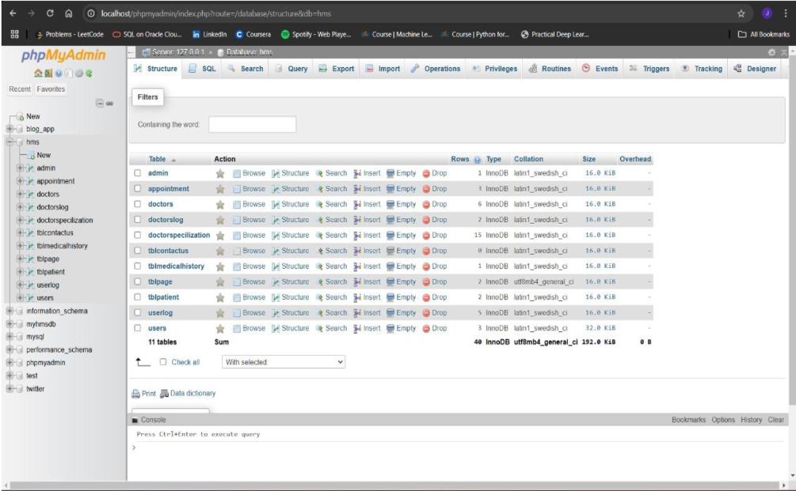
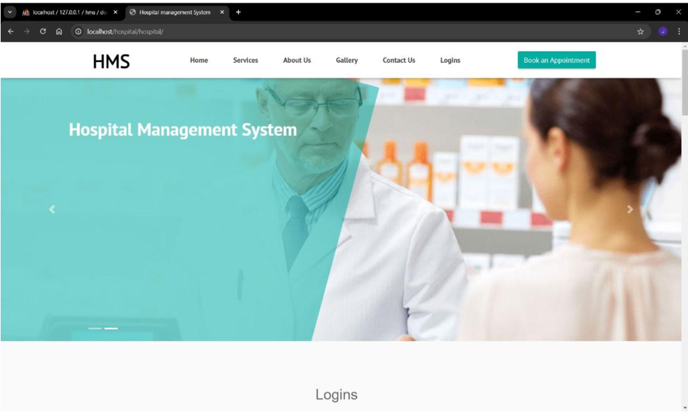
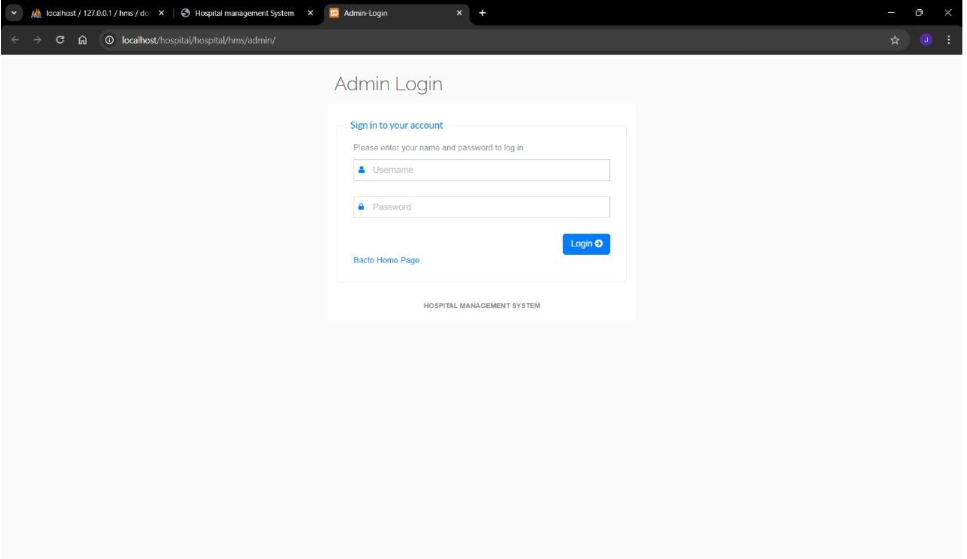
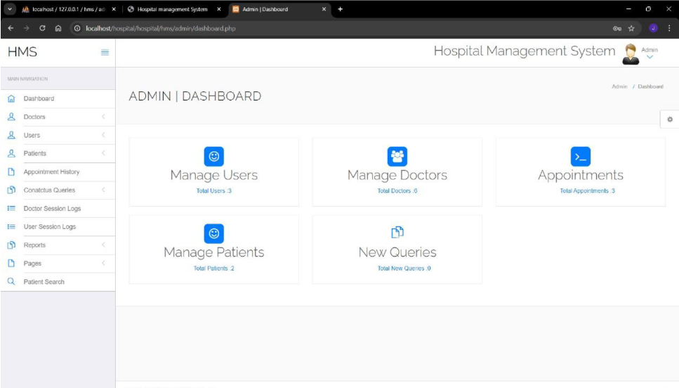

# Hospital Management System

## Overview
The Hospital Management System (HMS) is a web-based application designed to streamline hospital operations, including patient management, doctor appointments, staff records, and billing. Developed using PHP and MySQL, it ensures efficient healthcare delivery and data management.

## Features
- **Admin Module**: Manage doctors, staff, patients, and appointments.
- **Doctor Module**: View schedules, patient records, and appointments.
- **Patient Module**: Book appointments, view medical history, and manage bills.
- **Billing**: Automated invoice generation for patient services.
- **Login System**: Secure access for admins, doctors, and patients.

## Technologies Used
- **Frontend**: HTML, CSS, JavaScript
- **Backend**: PHP
- **Database**: MySQL
- **Server**: Apache (XAMPP)

## How to Run Project Using PHP and MySQL

1. Download the zip file.
2. Extract the file and copy the `hospital` folder.
3. Paste it inside the root directory:
   - For XAMPP: `xampp/htdocs`
   - For WAMP: `wamp/www`
   - For LAMP: `var/www/html`
4. Open PHPMyAdmin (http://localhost/phpmyadmin).
5. Create a database with the name `hms`.
6. Import the `hms.sql` file (given inside the zip package in the SQL file folder).
7. Run the script: [http://localhost/hospital](http://localhost/hospital) (frontend).

## Login Details
- **Admin Login**: 
  - Username: `admin`
  - Password: `Test@12345`
  
- **Patient Login**: 
  - Username: `johndoe12@test.com`
  - Password: `Test@123`
  
- **Doctor Login**: 
  - Username: `anujk123@test.com`
  - Password: `Test@123`

